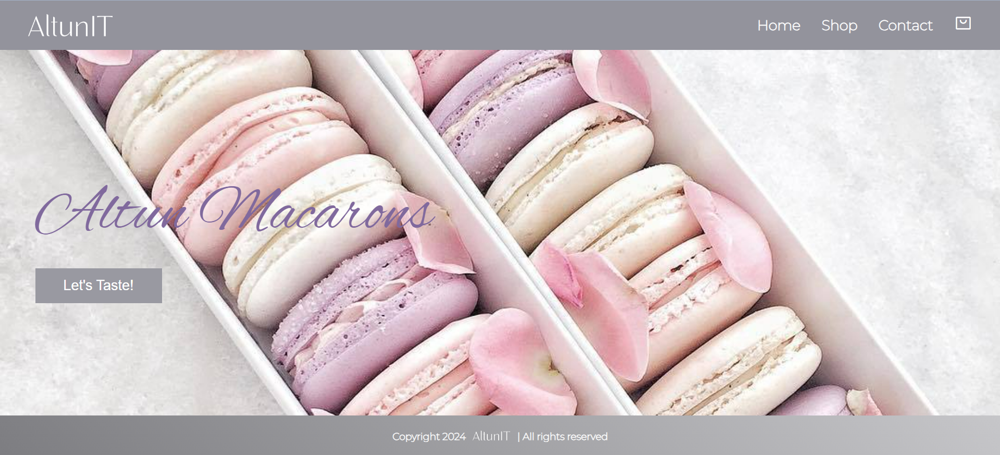

# AltunIT | Altun Macarons

# Opdrachtbeschrijving

## Inleiding
Welkom bij de AltunIT cursus! In deze cursus leer je stap voor stap hoe je een prachtige en functionele website bouwt voor een macaronwinkel. Je begint met het opzetten van de basisstructuur met HTML en CSS, waarbij je leert hoe je een Homepagina, Shop-pagina en Contactpagina vormgeeft. Vervolgens voegen we met JavaScript interactiviteit toe, zoals het valideren van een contactformulier en het dynamisch bijwerken van een winkelwagen. Tot slot gaan we de website omzetten naar ReactJS, zodat je leert werken met componenten en routing voor een moderne, schaalbare webapplicatie.

De cursus is opgedeeld in meerdere modules. We starten in Module 1 met het bouwen van de basisstructuur van de website met behulp van HTML en CSS. In Module 2 leren we JavaScript om de website interactief te maken, zoals formuliervalidatie. 
Tot slot, in Module 3, gaan we de website omzetten naar ReactJS om routing toe te voegen en de website schaalbaar en dynamisch te maken.

## Afbeelding 1: Eindresultaat van de Home Pagina | Altun Macarons website

# Stappenplan:
## In module 1: HTML & CSS
1. Hoofdstuk 4: Navigatiebalk, Banner en Footer voor de Homepagina
   - We starten met het bouwen van de navigatiebalk voor de website. Deze bevat links naar de Home, Shop, Contact, en Winkelwagen pagina’s. Hoewel de links op dit moment nog niet actief zijn, leer je in Module 3 ReactJS hoe je deze links werkend maakt met behulp van React Router om soepel tussen de verschillende pagina's te navigeren.
   - Daarna voegen we de banner toe aan de Homepagina, waarin de titel van de website en een call-to-action knop te vinden zijn. 
   - Je leert ook hoe je afbeeldingen als achtergrond kunt gebruiken en hoe je met CSS Flexbox en CSS Grid een responsieve en nette lay-out maakt.
   - Tot slot maken we de footer, die informatie bevat over het copyright en eventueel links naar een website of contactinformatie. Dit geeft de website een professioneel en afgerond uiterlijk.
2. Hoofdstuk 4: Indeling van de Shop-pagina
   - We ontwerpen de Shop-pagina, waar een overzicht van verschillende macaron-producten in een nette grid-layout komt te staan. Hiervoor maken we gebruik van CSS Flexbox of CSS Grid.
   - Elk product bevat een afbeelding, een naam en een prijs. Je leert hoe je met CSS een nette en overzichtelijke indeling maakt.
   - De Shop-pagina zal nog niet dynamisch reageren omdat we in Module 2 (JavaScript) de functionaliteit zullen toevoegen.
4. Hoofdstuk 5: Contactformulier maken
   - In dit hoofdstuk maak je een contactformulier voor de Contactpagina. Het formulier bevat velden voor voornaam, achternaam, e-mailadres, en een bericht.
   - We leren hoe je HTML-formulieren kunt gebruiken en hoe je ze met CSS kunt stylen om een professioneel uiterlijk te creëren.
   
## In module 2: JavaScript
1. Basiskennis JavaScript
   - In deze module leer je de basis van JavaScript, de meest gebruikte programmeertaal voor webontwikkeling. Met JavaScript maak je websites interactief, wat betekent dat gebruikers met de pagina kunnen communiceren en dat de pagina reageert op hun acties. Denk aan het valideren van formulieren of het dynamisch bijwerken van de inhoud van de pagina.
2. Formuliervalidatie toevoegen aan de Contactpagina
   - Je leert hoe je formuliervalidatie kunt toevoegen aan het contactformulier. Dit zorgt ervoor dat velden zoals naam en e-mailadres correct worden ingevuld voordat het formulier kan worden verzonden.
   - Hierbij zullen we ook foutmeldingen implementeren voor gebruikers als zij iets verkeerd invullen of verplichte velden leeg laten.
   

## In module 3: ReactJS
5. Omzetten van de website naar ReactJS
   - In deze module zetten we de bestaande HTML en CSS om naar **ReactJS**. ReactJS is een krachtig JavaScript-framework waarmee je websites schaalbaarder en onderhoudsvriendelijker maakt. Dit doen we door gebruik te maken van **herbruikbare componenten**. In plaats van dezelfde code steeds opnieuw te schrijven, kunnen we componenten maken die overal op de website hergebruikt kunnen worden, zoals knoppen, formulieren of productkaarten.
6. Routing tussen pagina's instellen
   - We gebruiken React Router om de navigatie tussen de vier pagina's te implementeren: de Homepagina, Shop, Contact, en de Winkelwagen.
   - React Router maakt het mogelijk om de navigatie tussen deze pagina's snel en efficiënt te laten verlopen zonder dat de hele pagina opnieuw geladen hoeft te worden.
7. Winkelwagen functionaliteit afronden
   - We maken de winkelwagen volledig functioneel met behulp van React State Management (bijvoorbeeld met useState). Dit zorgt ervoor dat producten in de winkelwagen dynamisch worden bijgewerkt.

## Eindopdracht: Website Finaliseren
   - In de eindopdracht combineren we alles wat je hebt geleerd om een volledige, gestileerde website te maken. Je zorgt voor consistentie in de opmaak en maakt de website responsief met CSS media queries, zodat hij er goed uitziet op zowel desktops als mobiele apparaten.

# Einddoel
Aan het einde van de cursus beschik je over de vaardigheden om een complete, professioneel gestileerde website te maken met HTML en CSS. Je leert hoe je de structuur van een website opbouwt, verschillende pagina's zoals de Homepagina, Shop, Contactpagina, en Winkelwagen indeelt, en hoe je een navigatiebalk en footer toevoegt om je website af te ronden.
Je beschikt nu over de basisvaardigheden om aantrekkelijke en functionele websites te bouwen. Je bent klaar om je kennis verder uit te breiden met meer geavanceerde webtechnieken in toekomstige cursussen, zoals JavaScript en ReactJS.

## Afbeelding 2: Eindresultaat van de Altun Macarons website

Dit is het eindresultaat van de cursus, waarin je een volledig functionele en professioneel gestileerde website voor een macaronwinkel maakt.
